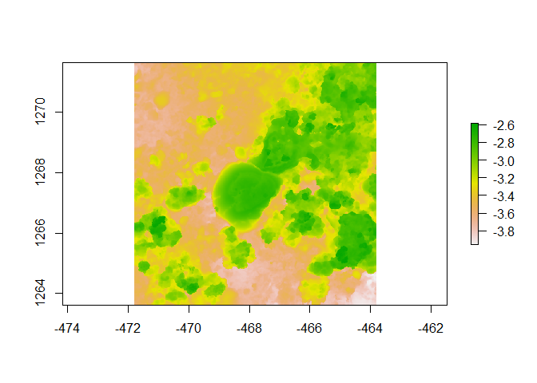

Assignment
================
Rachel Nunley
2023-08-16

``` r
library(raster)
```

    ## Loading required package: sp

    ## The legacy packages maptools, rgdal, and rgeos, underpinning the sp package,
    ## which was just loaded, will retire in October 2023.
    ## Please refer to R-spatial evolution reports for details, especially
    ## https://r-spatial.org/r/2023/05/15/evolution4.html.
    ## It may be desirable to make the sf package available;
    ## package maintainers should consider adding sf to Suggests:.
    ## The sp package is now running under evolution status 2
    ##      (status 2 uses the sf package in place of rgdal)

``` r
library(habtools)
```

    ## 
    ## Attaching package: 'habtools'

    ## The following object is masked from 'package:raster':
    ## 
    ##     extent

``` r
library(ggplot2)
library(dplyr)
```

    ## 
    ## Attaching package: 'dplyr'

    ## The following objects are masked from 'package:raster':
    ## 
    ##     intersect, select, union

    ## The following objects are masked from 'package:stats':
    ## 
    ##     filter, lag

    ## The following objects are masked from 'package:base':
    ## 
    ##     intersect, setdiff, setequal, union

``` r
library(fishualize)
plot(horseshoe)
```

    ## Warning in sp::CRS(...): sf required for evolution_status==2L

    ## Warning in sp::CRS(...): sf required for evolution_status==2L

<!-- -->

### Current lab

ToBo Lab

### Project focus

Sponge Taxonomy

### Why you chose this course

This course will give me a better understanding of coral reefs in
general and hopefully I’m able to apply this to my sponge research.

### What do you want to learn about the most in this course

I hope to be more proficient in R but also learn more about reef
structure and function so I can better understand the roles sponges play
in this ecosystem.

### Your R experience

I took MBIO 612 with Mahdi, I also took ZOOL 780/781 which required a
heavy use of R related to population changes and other
ecological/evolutionary concepts. I’m not great at R, but I have
beginner-intermediate experience.

### Fun fact

I have a cat, his name is Winston. We like to go on walks together.
